Live - https://noman1922.github.io/CMS-Contest-Management-System/

# CMS - Contest Management System

An enterprise-grade, frontend-driven Contest & Assessment Management System designed for organizing, administering, and participating in structured multi-track competitions and evaluations. Built for the **ACI Career Edge Program**, the platform features complete multi-contest architecture, dynamic task composition, real-time proctoring telemetry, automated scoring, and responsive candidate workspaces.

---

## Overview

The **CMS (Contest Management System)** provides an end-to-end operational hub for running complex competitive evaluations and corporate challenge tracks. The system manages the complete contest lifecycle—from multi-contest scheduling and participant roster management with individual eligibility controls, to interactive candidate test environments with timer enforcement, live proctoring telemetry (webcam, microphone, and tab-switch tracking), and real-time live leaderboards with automated scoring.

Operating with a robust client-side storage architecture backed by HTML5 `LocalStorage`, the application runs completely standalone with zero external database or backend server dependencies, making it suitable for live demonstrations, evaluation showcases, and static hosting via GitHub Pages.

---

## Key Features

- **Multi-Contest Architecture**: Independent contest workspaces with separate configurations, lifecycle states (LIVE, DRAFT, COMPLETED), start/end times, and task assignments.
- **Role-Based Access Control (RBAC)**: Dedicated interfaces and authentication guards for **System Administrators** and **Participants**, featuring seamless one-click demo role switching.
- **Dynamic Task Builder**: Administrative task creation supporting modular assessment types:
  - Multiple Choice Questions (Single and multi-select with automated instant grading).
  - Open-ended written analysis / case study prompts.
  - Document attachments (PDF guidelines with an in-app reader modal) and participant PDF file uploads.
- **Contest Discovery & Eligibility Management**: Participants discover available contests and can only enter competitions to which their profile has been granted eligibility.
- **Interactive Participant Assessment Workspace**:
  - Live synchronized countdown timers with auto-save and submission deadlines.
  - Question-by-question navigator with visual answered/flagged indicators.
  - In-app document viewer for confidential prompt briefs.
  - PDF file upload handler with file size validation.
- **Proctoring Telemetry & Monitoring**:
  - Live webcam and microphone hardware verification via standard Web APIs (`navigator.mediaDevices.getUserMedia`).
  - Fullscreen enforcement with real-time breach detection.
  - Browser tab-switching and window blur telemetry logging.
- **Scoring Engine & Live Leaderboard**:
  - Weighted grading engine calculating objective points, written answer evaluations, and integrity penalty deductions.
  - Real-time ranking with cohort filtering, search, and CSV data export.
- **Administrative Review & Submissions Queue**: Detailed submission inspection modal allowing evaluators to review participant answers, verify uploaded PDFs, and assign manual grades.
- **Candidate Progress & Results Portal**: Comprehensive score breakdowns, rank standing, performance analytics, and certificate status.

---

## System Roles

### Admin (Assessment Director / Coordinator)
- **Contest Management**: Create, edit, and monitor multiple concurrent contests; configure proctoring strictness, start/end windows, and leaderboard visibility.
- **Task Authoring**: Build modular assessment tasks, set point weights, attach guidelines, and define automated grading keys.
- **Participant Roster & Eligibility**: Import candidate rosters, assign cohort tags, toggle contest eligibility, and generate personalized access invitations.
- **Proctoring Operations**: Monitor active sessions, view flagged proctoring infractions (webcam interruptions, tab switches, fullscreen exits).
- **Submissions & Grading**: Review submitted work, grade open-ended answers, override scores, and export leaderboard rankings to CSV.

### Participant (Candidate)
- **Contest Selection**: Browse registered and open contests, review eligibility criteria, and enter active assessments.
- **Assessment Workspace**: Complete timed tasks, answer multiple-choice questions, compose written recommendations, review case study PDFs, and upload supplementary reports.
- **Telemetry Verification**: Grant required webcam/mic access and enter monitored fullscreen mode.
- **Live Leaderboard & Analytics**: View current standing, cohort comparisons, individual progress metrics, and official results upon contest conclusion.

---

## Contest Workflow

```mermaid
graph TD
    subgraph Admin Workflow
        A1[Create Contest & Configure Rules] --> A2[Author Tasks & Scoring Criteria]
        A2 --> A3[Assign Eligible Candidates / Cohorts]
        A3 --> A4[Monitor Live Telemetry & Proctoring]
        A4 --> A5[Review Submissions & Publish Results]
    end

    subgraph Participant Workflow
        P1[Sign In with Access Code / Demo] --> P2[Select Eligible Contest]
        P2 --> P3[Pass Telemetry & Device Checks]
        P3 --> P4[Answer MCQs, Written & Upload Reports]
        P4 --> P5[Submit Assessment]
        P5 --> P6[Track Standing on Live Leaderboard]
    end
```



1. **Admin** creates a contest (e.g. *Business Strategy Challenge 2026*), sets time windows, and specifies proctoring requirements.
2. **Admin** uses the Dynamic Task Builder to create questions, set points, and upload case briefs.
3. **Admin** manages eligibility in the participant directory, granting access to designated candidates.
4. **Participant** logs in, selects the active contest, verifies hardware permissions, and enters the secure test interface.
5. **Participant** answers questions with continuous local auto-save, reviews case materials, uploads documents, and submits.
6. **Scoring Engine** evaluates objective answers; Admin reviews written submissions and finalizes scores.
7. **Leaderboard & Results** update automatically in real time across participant and administrative dashboards.

---

## Tech Stack

- **Core Structure**: HTML5 Semantic Architecture.
- **Styling**: Vanilla CSS3 Custom Design System (CSS Custom Properties, Flexbox, CSS Grid, Glassmorphism, Micro-animations).
- **Behavior & Logic**: Vanilla JavaScript (Modern ES6+).
- **Persistence Layer**: Client-Side HTML5 `LocalStorage` abstraction (`StorageService`) with pre-seeded demonstration datasets.
- **Web Platform APIs**:
  - `MediaDevices.getUserMedia()` for webcam and microphone stream verification.
  - `Fullscreen API` for proctored browser lockdown.
  - `Page Visibility API` (`visibilitychange`, `blur`/`focus`) for tab-switch tracking.
- **Typography & Icons**: Google Fonts (*Manrope*, *Inter*) and Google Material Symbols Outlined.

---

## Project Structure

```text
CMS-Contest-Management-System/
├── index.html                      # Portal Entry: Sign-In & Role Selector
├── 404.html                        # Fallback / Not-Found Page
├── assets/
│   └── logo.svg                    # Vector Corporate Brand Emblem
├── css/
│   ├── style.css                   # Core Design Tokens, Utilities, Components
│   └── responsive.css              # Breakpoint Media Queries & Mobile Drawers
├── js/
│   ├── admin.js                    # Admin Workspace Controller & Actions
│   ├── auth.js                     # Authentication, Session Guard & RBAC
│   ├── data.js                     # Initial Seed Datasets & Demonstrations
│   ├── leaderboard.js              # Ranking Engine & CSV Export Logic
│   ├── monitoring.js               # Hardware Telemetry & Proctoring Listeners
│   ├── participant.js              # Participant Assessment Engine & Timers
│   ├── pdf.js                      # In-App PDF Previewer Modal & Cache
│   ├── scoring.js                  # Automated & Rubric Scoring Engine
│   ├── storage.js                  # Central LocalStorage CRUD Service Layer
│   ├── tasks.js                    # Dynamic Task & Question Builder
│   └── ui.js                       # Reusable UI Helpers (Toasts, Modals, Breadcrumbs)
├── admin/
│   ├── contests.html               # Multi-Contest Management
│   ├── dashboard.html              # Admin Operational Metrics Overview
│   ├── leaderboard.html            # Administrative Leaderboard & Export
│   ├── monitoring.html             # Real-Time Telemetry & Proctoring Events
│   ├── participants.html           # Candidate Directory & Eligibility Assignment
│   ├── results.html                # Scoring Results & Certificate Distribution
│   ├── settings.html               # Contest Configuration & Telemetry Rules
│   ├── submissions.html            # Submissions Queue & Grading Interface
│   └── tasks.html                  # Dynamic Task Authoring Environment
├── participant/
│   ├── contests.html               # Contest Discovery & Enrollment Portal
│   ├── dashboard.html              # Participant Contest Dashboard
│   ├── leaderboard.html            # Public Live Rankings & Metric Cards
│   ├── profile.html                # Candidate Information & Session Details
│   ├── progress.html               # Task Completion & Performance Analytics
│   ├── task.html                   # Assessment Answering Environment
│   └── tasks.html                  # Contest Task List & Status Indicators
├── .github/
│   └── workflows/
│       └── deploy.yml              # GitHub Actions Automated Pages Deployment
├── .gitignore                      # Git Exclusions
├── .env.example                    # Environment Template & Configuration Notes
└── README.md                       # Comprehensive Project Documentation
```

---

## Getting Started

### Prerequisites
Any modern web browser (Google Chrome, Mozilla Firefox, Microsoft Edge, or Apple Safari) with JavaScript enabled. No build tools or package managers (`npm`, `yarn`) are required.

### Running Locally

1. **Clone the repository**:
   ```bash
   git clone https://github.com/noman1922/CMS-Contest-Management-System.git
   cd CMS-Contest-Management-System
   ```

2. **Serve with a local static web server**:

   *Using Python 3 (Built-in)*:
   ```bash
   python -m http.server 8080
   ```

   *Using Node.js (`npx serve`)*:
   ```bash
   npx serve . -p 8080
   ```

   *Using VS Code*:
   Install the **Live Server** extension, open the root directory, and click **Go Live**.

3. **Open in your browser**:
   ```text
   http://localhost:8080/index.html
   ```

### Demo Accounts & Credentials

The system includes pre-configured accounts with instant one-click login buttons on the sign-in page:

| Role | Name | Email / Phone | Password | Access Scope |
| :--- | :--- | :--- | :--- | :--- |
| **Admin** | Dr. Alistair Vance | `admin@demo.com` | `admin123` | Full administrative control, task builder, proctoring & grading |
| **Participant** | Elena Rostova | `+8801700000027` | `123456` | Candidate workspace, test taking, live leaderboard |
| **Participant** | Marcus Chen | `+8801700000028` | `123456` | Cohort B candidate |

*Tip: You can switch roles at any time using the **Switch to Admin / Participant** button located in the top navigation bar.*

---

## Build

Because this application is developed with pure Vanilla HTML5, modern CSS3, and standard ES6 JavaScript, **no compilation or bundling step is required**. 

The source code is production-ready as-is:
- No transpilation (`Babel`, `TypeScript`) needed.
- No bundler (`Webpack`, `Vite`, `Rollup`) required.
- All asset and navigation paths are strictly relative, allowing the application to run smoothly under root domains, subdirectories, or static CDN origins.

---

## Deployment

### GitHub Pages (Automated Deployment)

This repository includes a native GitHub Actions workflow in [`.github/workflows/deploy.yml`](.github/workflows/deploy.yml).

To activate automated deployment on GitHub:
1. Navigate to your repository on GitHub: `https://github.com/noman1922/CMS-Contest-Management-System`.
2. Go to **Settings** > **Pages**.
3. Under **Build and deployment** > **Source**, select **GitHub Actions**.
4. Push a commit to the `main` branch (or run the workflow manually under the **Actions** tab).
5. The application will be automatically deployed to:
   ```text
   https://noman1922.github.io/CMS-Contest-Management-System/
   ```

### Alternative Static Hosting
The project can also be hosted on **Netlify**, **Vercel**, **Cloudflare Pages**, or **AWS S3** by simply selecting the repository root as the publish directory without specifying any build command.

---

## Environment Variables

For zero-setup static execution and local demonstration, the platform uses an in-memory/localStorage seed layer. If integrating with an external production backend, copy the example file:

```bash
cp .env.example .env
```

Refer to [`.env.example`](.env.example) for placeholder configurations (API endpoints, database connections, and auth secrets).

---

## Future Improvements

- **Backend API Integration**: Connect to a Node.js/Go REST/GraphQL backend with PostgreSQL for multi-tenant enterprise data persistence.
- **Automated Code Execution Engine**: Add sandbox code execution (Judge0 / Piston) for automated software coding contests.
- **Multi-Evaluator Rubrics**: Support multi-judge scoring panels with blind review capabilities.
- **WebRTC Proctoring Feeds**: Real-time peer-to-peer live video feeds streamed directly to the admin proctoring console.

---

## License

This project is open-source and available under the [MIT License](LICENSE).
